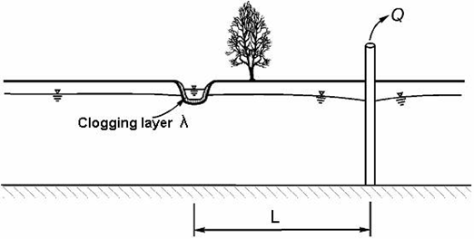

Stream depletion methods
=========================

Background
-----------
All of these stream depletion methods are derivations from the fundamental groundwater principles. They have been specifically derived to estimate the ratio of the stream water compared to the surrounding groundwater during pumping of a nearby well. In all of the following conceptual models, they represent simplified representations of the groundwater system to ensure that the input requirements are minimised. The complexity of the conceptual groundwater model increases with the input requirements. This page describes the methods in a sequence from the most simple to the most complex. The names used in the python package will be labeled in **bold** for reference.

A very good review of the various stream depletion solutions can be found in Bruce Hunt's `Review of Stream Depletion Solutions, Behavior, and Calculations <https://drive.google.com/file/d/17TxmLKOWE-lgpKKs8jBKX-S-Ss8mQ-47/view?usp=sharing>`_. Many of the following diagrams come from this paper.

Input aquifer (and stream) parameters
-------------------------------------
All methods have aquifer and stream input parameter requirements. This section will list all of the input parameter names used in the python package with a description of what they mean (glossary):

.. code-block::

	sep_distance : int
      The separation distance from the pumped well to the stream.
  pump_aq_trans : int
      The pumped (confined) aquifer transmissivity (m2/day).
  pump_aq_s : float
      The storage coefficient of the pumped aquifer.
  upper_aq_trans: int
      The surficial aquifer transmissivity (m2/day).
  upper_aq_s : float
      The storage coefficient of the surficial aquifer.
  lower_aq_trans: int
      The confined aquifer transmissivity (m2/day).
  lower_aq_s : float
      The storage coefficient (specific storage) of the confined aquifer.
  aqt_k : int
      The aquitard hydraulic conductivity (m/day).
  aqt_s : float
      The aquitard storage coefficient.
  aqt_thick : int
      The aquitard vertical thickness (m).
  stream_k : int
      Streambed hydraulic conductivity (m/day).
  stream_thick : int
      The streambed vertical thickness (m).
  stream_width : int
      The streambed width (m).

Theis 1941
----------
The Theis 1941 solution labeled **theis_1941** in the python package represents a straight river fully penetrating a homogeneous, isotropic aquifer of semi-infinite extent, which can be either confined or unconfined.

.. figure:: img/theis_1941.png

	 The conceptual model diagram of Theis 1941.

input parameters
~~~~~~~~~~~~~~~~
	- sep_distance
	- pump_aq_trans
	- pump_aq_s

Hunt 1999
---------
The Hunt 1999 solution labeled **hunt_1999** in the python package represents a stream that partially penetrates an aquifer extending to infinity in all horizontal directions. Where the aquifer is again homogeneous and isotropic with a semi-infinite extent.

	 The conceptual model diagram of Hunt 1999.

input parameters
~~~~~~~~~~~~~~~~
	- sep_distance
	- pump_aq_trans
	- pump_aq_s
	- stream_k
	- stream_thick
	- stream_width

Hunt 2003
---------
The Hunt 2003 solution labeled **hunt_2003** in the python package represents a similar conceptual model as the Hunt 1999 except that the pumped aquifer underlays an aquitard containing a free surface.

	 The conceptual model diagram of Hunt 2003.

input parameters
~~~~~~~~~~~~~~~~
	- sep_distance
	- pump_aq_trans
	- pump_aq_s
	- stream_k
	- stream_thick
	- stream_width
	- aqt_k
	- aqt_thick
	- aqt_s

Hunt 2009
---------
The Hunt 2009 solution labeled **hunt_2009** in the python package represents a similar conceptual model as the Hunt 1999 except that the pumped aquifer overlays an aquitard and a second unpumped confined aquifer.

	 The conceptual model diagram of Hunt 2009.

input parameters
~~~~~~~~~~~~~~~~
	- sep_distance
	- pump_aq_trans
	- pump_aq_s
	- stream_k
	- stream_thick
	- stream_width
	- aqt_k
	- aqt_thick
	- lower_aq_trans
	- lower_aq_s

Ward and Lough 2011
-------------------
The Ward and Lough 2011 solution labeled **ward_lough_2011** in the python package represents a similar conceptual model as the Hunt 2009 except that the pumped aquifer is now the lower confined aquifer.

	 The conceptual model diagram of Ward and Lough 2011.

input parameters
~~~~~~~~~~~~~~~~
	- sep_distance
	- pump_aq_trans
	- pump_aq_s
	- stream_k
	- stream_thick
	- stream_width
	- aqt_k
	- aqt_thick
	- upper_aq_trans
	- upper_aq_s
